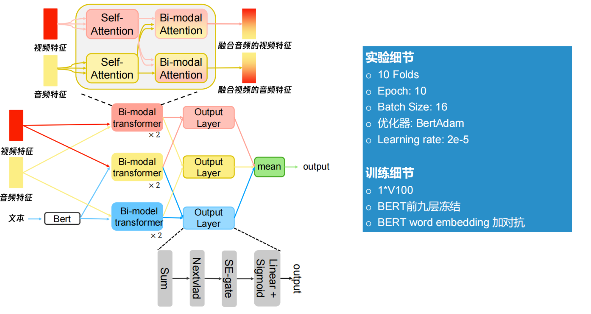

# **2021年腾讯广告算法大赛赛道二-两面包夹芝士方案**

├── dataset 数据集存放位置，运行init.sh会自动生成  
│   ├── test_2nd 测试集存放位置  
│   └── train 训练集存放位置  
├── taac2021-tagging-lmbjzs 代码主文件夹  
│   ├── checkpoint 模型保存地址  
│   ├── config 配置文件  
│   ├── inference.py 推理代码  
│   ├── inference.sh 推理脚本 接收两个参数，第一个参数是操作，第二个参数是数据集路径，用于视频特征提取  
│   ├── __init__.py  
│   ├── init.sh 初始化脚本 包括环境配置、数据集目录生成以及数据拷贝，接收一个参数，即原始数据集路径  
│   ├── post-processing 后处理代码  
│   ├── pre 预处理代码  主要是视频特征提取代码  
│   ├── pretrain_models 预训练模型存位置  
│   ├── readme.md   
│   ├── requirement.txt 环境要求  
│   ├── src 模型以及数据集代码  
│   ├── train.py 训练代码  
│   ├── train.sh 训练脚本 接收两个参数，第一个参数是操作，第二个参数是数据集路径，用于视频特征提取  
│   └── utils 工具类  

### **1 模型介绍**

### **2 环境配置**

我们环境是直接建立在腾讯云已有环境pytorch_py3的基础上
conda activate pytorch_py3    
cd taac2021-tagging-lmbjzs   
sudo apt-get install ffmpeg   
pip install -r requirement.txt   

也可以直接运行init.sh

### **3 预训练模型下载以及新特征提取**

链接：https://pan.baidu.com/s/1QpN11YqPUuEQHkI-hDSGUg 
提取码：taac

这个链接下有五个文件夹 vit-large; video_npy; efficient-b7; ckpt; bert-base.
其中，vit-large, efficient-b7存放的是提取视频特征的预训练模型；bert-base存放的是文本预训练模型；ckpt存放的是预训练模型，可直接用于预测；video_npy存放的是提取好的视频特征；

**关于使用**

1. video_npy 中有efficient.tar.tgz 和 vit.tar.tgz两个压缩包，分别解压到目录中dataset/train/video_npy/effcient 和dataset/train/video_npy/vit

2. vit-large， efficient-b7, 和bert-base中的文件分别下载到pretrain_models下对于的文件夹下

3. 若要使用预训练模型进行预测，将ckpt中的20个模型下载到taac2021-tagging-lmbjzs/checkpoint下，之后参照测试流程。

### **4 训练流程**

**如果下载使用vit提取的帧特征，可以直接从第三步开始**

1. 训练集视频帧抽取 
直接运行train.sh 脚本 接收两个参数，第一个是**frame** 代表抽帧，第二个是训练集视频路径, **视频路径最后需要有/**
sudo chmod a+x ./train.sh && ./train.sh frame ../../algo-2021/dataset/videos/video_5k/train_5k/
2. 训练集视频特征提取
直接运行train.sh 脚本 接收一个参数 **extract** 
sudo chmod a+x ./train.sh && ./train.sh extract
3. 训练集训练csv生成
    直接运行train.sh 脚本 接收一个参数，**generate** 
    sudo chmod a+x ./train.sh && ./train.sh generate
4. 训练
    直接运行train.sh 脚本 接收一个参数，**train** 
    sudo chmod a+x ./train.sh && ./train.sh train
    **抽帧，特征提取以及训练总体时间大概30个小时**

### **5 测试流程**

1. 测试集视频帧抽取 
直接运行train.sh 脚本 接收两个参数，第一个是**frame** 代表抽帧，第二个是训练集视频路径, **视频路径最后需要有/**
sudo chmod a+x ./inference.sh && ./inference.sh frame ../../algo-2021/dataset/videos/test_5k_2nd/

2. 测试集视频特征提取
直接运行inference.sh 脚本 接收一个参数 **extract** 
sudo chmod a+x ./inference.sh && ./inference.sh extract

3. 测试集数据集生成
直接运行inference.sh 脚本 接收一个参数，**generate** 
sudo chmod a+x ./inference.sh && ./inference.sh generate

4. 推理
直接运行inference.sh 脚本 接收一个参数，**inference** 
sudo chmod a+x ./inference.sh && ./inference.sh inference

运行之后会在当前目录生成out.json，这个便是最后的结果

